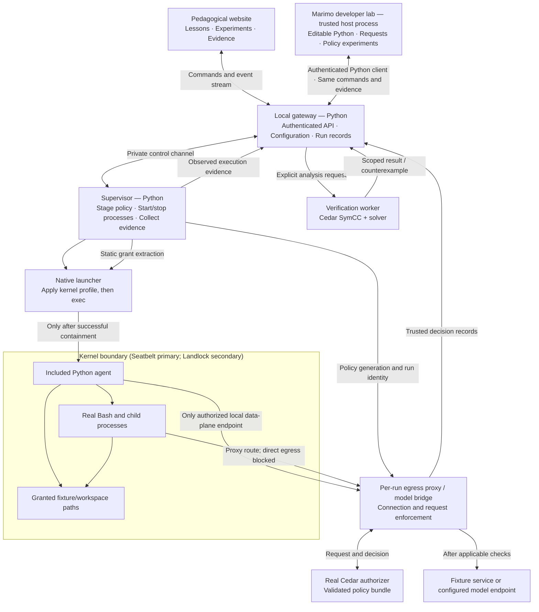

# Agent in a Box

## Purpose

Agent in a Box teaches developers how to sandbox an agent and how to enforce and reason about its permissions with Cedar policies and formal analysis. A learner gives an agent a task, changes its permissions, watches real allowed and denied operations, and uses symbolic analysis to discover what the policies could permit beyond the observed run.

Three experiences share one runtime, one scenario, one policy set, and one evidence format:

- a **pedagogical website** with a guided course and live or recorded experiments;
- a **marimo developer lab** for modifying those experiments in Python;
- a small **working native runtime**: a real gateway, supervisor, Python agent harness, real files and Bash, kernel-enforced isolation, actual Cedar authorization, and Cedar SymCC analysis.

It is a small, self-contained runtime: no orchestration platform, no container, no VM, and nothing to deploy beyond the local gateway.

**Guiding question:** How do we apply Cedar to an agent's interactions, observe its behavior under those policies, and establish properties beyond the actions it happened to try?

**Threat model, in two sentences.** The model's output is untrusted: it can be wrong, it can be steered by content it reads, and it changes between versions. The policy and the boundary are what we trust, and the course is about making that trust precise, observable, and provable where proof applies.

### Status

Revised 2026-10-09 to make the plan executable by an independent implementing agent. Earlier revisions and the reviews that shaped them are kept outside the public tree.

As of 2026-10-09, Milestone 0's platform-independent core is implemented and tested on Linux under the test backend only (see [STATUS.md](STATUS.md)); no native backend exists yet. The development workspace is Linux. The primary native backend is macOS Seatbelt. A Linux backend is scheduled as a secondary target that may never reduce the macOS experience (see [Platform decision](#platform-decision) and [ADR 0001](decisions/0001-linux-backend-secondary.md)). No native-enforcement claim may be made anywhere in this repository until [STATUS.md](STATUS.md) records a passing native suite with OS build, hardware, and date.

## How to use this plan

This plan is written so that an implementing agent, human or AI, can pick it up and work autonomously toward the definition of done over a long horizon. Read it in full before writing code.

### Reading order

1. This file.
2. [CURRICULUM.md](CURRICULUM.md): the learner persona, glossary of claim words, shared scenario and policy variants, scripted agent strategy, controlled probes, pilot protocol, and a learning contract per chapter. Lessons are built from these contracts; change the contract before changing a lesson.
3. [STATUS.md](STATUS.md): current milestone, gate checklists, blockers, questions for the owner, and the last native validation.
4. [decisions/](decisions/README.md): architecture decision records. Read all of them before changing anything they cover.

### Definition of done

Release 1 is complete when all of the following hold:

- On a supported Mac, a developer with no model account runs the chapter 0 trailer live: a contained scripted agent reads the measurements fixture, fetches reference data through the proxy, writes a report; the policy is broadened; the unchanged examples pass; the solver returns a POST witness; replay shows old deny and new allow; the repair yields "no permission expansion in domain D" and "intended task preserved"; the run exports as a bundle.
- The Linux backend passes the same conformance suite on a named kernel and distribution, or release 1 ships macOS-only with Linux labeled experimental. Linux never delays or alters the macOS release.
- The GitHub Pages site serves chapters 0 through 9 and the capstone. Chapters marked hosted-interactive in CURRICULUM.md work with no native tools. Recorded content is labeled recorded.
- Notebooks 01 through 06 run in recorded mode in CI and in live mode on a supported Mac.
- Website, CLI, and marimo produce compatible bundles for the same experiment.
- The pilot gate has passed: two of three developers new to Cedar complete the five unaided explanations in CURRICULUM.md after chapters 0 and 5.
- Every acceptance list in this plan passes, the native suite passes on the named platform versions, and the toolchain manifest, source provenance, and licenses are recorded.

### Invariants

These hold at every commit. A change that weakens one is outside the implementing agent's authority.

1. **No failure path leads to unconfined execution.** Launcher failure, unsupported OS, missing tools, or a live-mode error refuses the run. The test-only `NoEnforcementBackend` is selected only by explicit test or developer configuration, never by the gateway's public commands and never as a fallback.
2. **Evidence provenance is never fabricated.** No Cedar event is invented for a kernel denial. No "proved" label for UNKNOWN, timeout, unsupported, or replay disagreement. Recorded evidence is labeled recorded. Runs under the test backend carry `enforcement: none` and are never shipped as recorded native runs.
3. **The workload cannot reach the control plane.** The agent and its children cannot change policy, read credentials or supervisor state, launch an unrestricted process, or forge a trusted record through the browser, API, or filesystem.
4. **Credentials never enter the workload or exports.** Provider keys live only in the trusted bridge. Bundles contain logical destinations and nonsecret transport mappings.
5. **Policy proofs carry no runtime claims.** A SymCC result is about a Cedar relation over a stated domain. Derived grants, proxy behavior, and kernel behavior need their own evidence. Learner-facing text uses the CURRICULUM.md glossary verbatim; "containment" refers only to the OS boundary.
6. **Toolchain provenance is pinned and recorded.** Expected outcomes for oracle cases are never generated by the implementation under test.
7. **No native-enforcement claim without a recorded native run.** STATUS.md names the OS build, hardware, date, and suite. A CI run on a GitHub-hosted macOS runner satisfies this when its runner image, macOS build, and run URL are recorded. Documentation and website copy may not claim native behavior that has not been so recorded.
8. **No accounts, telemetry, grading, or system trust-store changes.** Predictions are private and local. Per-run CAs are trusted only by contained clients.
9. **The teaching source route stays within its line budgets** (see [Modularity](#modularity-and-careful-abstractions)). Readability of the pedagogical path is a requirement.
10. **Agent output is untrusted data everywhere**: in the UI, in logs, in bundles, and in the harness.
11. **macOS primacy.** Shared contracts, the grant plan, the probe set, the conformance suite, and the evidence schema are designed from the macOS Seatbelt backend's requirements. A Linux need may add an optional capability flag; it may never add a required parameter, weaken a guarantee, drop a test, or lower a default. Linux gaps are disclosed by capability flags and the doctor, never papered over.

### Decision authority

| You may | Examples |
| --- | --- |
| Decide and proceed | Module layout within the given tree, naming, test organization, lint and formatter configuration, internal data structures, website component structure, copy edits that do not change a chapter contract, fixture content that preserves the contract. |
| Decide and record an ADR in `decisions/` | Cedar, SymCC, and solver versions; proxy component; launcher approach; Python and Node versions; any deviation from a plan section; any change to `contracts.py` after M2; any change to a chapter contract; any dependency with native code; bundle schema version changes; supported platform matrix. |
| Decide and record an ADR that states macOS impact | Any change to a shared contract, the grant plan, the conformance suite, or the evidence schema that is motivated by the Linux backend. The ADR must state that the macOS backend's behavior, requirements, and defaults are unchanged. If they would change, stop and ask instead. |
| Stop, write the question in STATUS.md, continue other work | Anything that would weaken an invariant; anything requiring paid accounts or real credentials; publishing anywhere other than the project's GitHub Pages site, which CI deploys from `main`; anything needing `sudo` beyond documented setup steps or touching system trust stores; dropping or merging a chapter; changing the platform decision; a suspected vulnerability in a reused component. |

An ADR has: context, decision, alternatives rejected, consequences, and the PLAN.md or CURRICULUM.md section it affects. When a decision changes this plan, edit the plan in the same change and cite the ADR number.

### Working on Linux

The development workspace is Linux. Most of the work does not need a kernel sandbox:

- **Milestone 0 is entirely platform-independent.** Cedar evaluation, SymCC and the solver, the harness, the proxy decision path, the fixture, the gateway, the bundle format, the website, and the notebooks all build and test on Linux.
- **`NoEnforcementBackend`** runs the workload as an ordinary subprocess so the whole pipeline can be exercised in tests. It is a test double, not a sandbox. Its evidence is labeled `enforcement: none`.
- **Profile renderers** (SBPL for macOS; Landlock rules, bubblewrap arguments, and the seccomp filter for Linux) are developed and tested as text on any platform and marked "untested natively" in STATUS.md until their native gate runs them. The SBPL renderer is written first even on a Linux workspace, because it defines the shared contract.
- **The native gates do not need a physical Mac.** CI runs on a GitHub-hosted Apple silicon macOS runner (`macos-15` today). Develop the Seatbelt launcher and native suite here, push, and read the macOS job's log. Native tests must be self-diagnosing, because the runner is the only place they execute. A physical Mac speeds up the loop and is the only way to try the local-lab experience as a learner; no gate requires one.
- **When a gate needs something you do not have**, record the blocker in STATUS.md, leave the gate open, and continue with platform-independent work from later milestones. Never mark a native gate complete from the wrong platform.

### Platform decision

The **primary native backend is macOS Seatbelt** on Apple silicon, chosen on 2026-10-09. A **Linux backend** (Landlock, namespaces, seccomp, bubblewrap) is **scheduled as a secondary target** by [ADR 0001](decisions/0001-linux-backend-secondary.md), specified in [Milestone 1-L](#milestone-1-l--linux-enforcement-backend-scheduled-secondary). The two are 1:1 at the contract level, not the mechanism level: the same grant plan in, the same probe outcomes and evidence schema out, different profile text and a few documented edge differences.

**Primacy rules.** These apply to every design and scheduling choice.

1. The shared contracts are designed from macOS requirements. The SBPL renderer and `SeatbeltBackend` define what the conformance suite expects; `LandlockBackend` conforms to it.
2. When Linux cannot match a macOS behavior, the Linux backend reports the gap through its capability flags and the doctor discloses it. The shared test stays; it is marked expected-fail for Linux with the documented reason. The macOS test is never removed or weakened.
3. When Linux offers something macOS does not (for example PID-namespace isolation), it is a Linux-only capability flag and a Linux-only test, never a shared requirement.
4. Shipped recorded bundles, website figures, and default lesson content come from macOS runs whenever a macOS run exists. Until one exists, Linux bundles may ship labeled `enforcement: landlock` and are replaced when macOS bundles become available.
5. When both platforms are available, macOS work comes first within every milestone. On a Linux-only workspace, Milestone 1-L proceeds, but any shared-contract change it motivates requires an ADR stating that macOS behavior, requirements, and defaults are unchanged.
6. Release 1 ships when the macOS gates pass. Linux is included if its gate has passed by then; otherwise it ships labeled experimental. Linux never delays release.

**Modularity requirement.** Each backend is a self-contained package behind one narrow protocol, with platform-specific native code confined to its own directory, no cross-backend imports, no `sys.platform` branches in core modules, and one conformance suite parameterized over backends. The concrete boundary is specified under [Backend module boundary](#backend-module-boundary).

### Keeping records

- **STATUS.md** is updated at the end of every working session: milestone, gate checklist state, blockers, questions for the owner, last native validation, session log line.
- **decisions/NNNN-short-title.md** for every ADR-level decision.
- **PLAN.md** is kept current. When reality diverges, change the plan and say why; the plan and the code must not disagree silently. Superseded plan text is kept outside the public tree.
- **inspiration/** is git-ignored and never published. Working notes about other projects, earlier plan revisions, and reviews live there. Public documents, code, comments, tests, and lock files name no third-party project as a source or reference; a CI grep gate enforces this. Do not vendor or adapt third-party code into the public tree.

### Open questions and defaults

Proceed with the default unless an ADR records a different choice.

| Question | Default | Record as |
| --- | --- | --- |
| Cedar version | The newest `cedar-policy` release supported by all of `cedarpy`, `cedar-policy-symcc`, and the official CLI, moved together. Decided: cedar-policy 4.12.0 with SymCC 0.6.0 ([ADR 0002](decisions/0002-cedar-toolchain-and-evaluator-binding.md)); differences from the newer 4.13.0 release are listed there. | ADR 0002 |
| Evaluator binding | Decided: `cedarpy` in process for concrete evaluation; a small Rust bridge (`native/cedar-bridge/`) for SymCC analysis, also usable as an interchangeable evaluator; the official CLI only as a test oracle, because it has no JSON output for decisions or witnesses ([ADR 0002](decisions/0002-cedar-toolchain-and-evaluator-binding.md)). | ADR 0002 |
| Solver | Decided: cvc5 1.3.1, the version SymCC documents, non-GPL static builds pinned by checksum ([ADR 0002](decisions/0002-cedar-toolchain-and-evaluator-binding.md)). | ADR 0002 |
| HTTP/TLS proxy component | Decided: mitmproxy 12.2.3 in regular mode, one process per run, with our decision path deciding every request before anything is sent upstream ([ADR 0004](decisions/0004-proxy-component-mitmproxy.md)). | ADR 0004 |
| macOS launcher | Evaluate `sandbox-exec -f` with a generated profile and a small helper calling `sandbox_init`. Choose what passes inheritance, grant, egress, and cleanup tests with the least custom native code. | ADR in M1 |
| Linux launcher | Decided: bubblewrap for the namespaces, the filesystem view, and loading a hand-built seccomp filter; a Python launcher that applies Landlock through its system calls, probes the confinement, and execs the workload; the proxy reached through a mounted Unix socket ([ADR 0010](decisions/0010-linux-launcher.md)). | ADR 0010 |
| Python | Decided: Python 3.12.15, uv 0.12.24, pytest, ruff; Rust 1.89 or later for the Cedar bridge ([ADR 0003](decisions/0003-development-toolchain.md)). | ADR 0003 |
| Web | Decided: Astro 7.3.8 with MDX on Node 24.21.0 LTS, telemetry off; TypeScript islands arrive with hosted interactivity ([ADR 0006](decisions/0006-website-toolchain.md)). | ADR 0006 |
| Hosted Cedar interactivity | Try the pinned version's WebAssembly build in the browser; fall back to precomputed decision tables over the bounded domain. | ADR |
| Scripted model format | A YAML strategy table loaded by the scripted adapter (CURRICULUM.md). | Proceed |
| Oracle contract cases | Expected outcomes come from an independent implementation (the official Cedar CLI for authorization semantics) or are authored from this plan's stated rules before the code exists; never from the implementation under test. Cases derived from third-party material stay outside the public tree and their test skips when they are absent. Decided: `tests/oracle/` from the official CLI and hand-authored compiler cases ([ADR 0009](decisions/0009-oracle-cases.md)). | ADR 0009 |
| Supported platform matrix | Decide from native results; do not extrapolate from other projects' claims. Linux decided: Debian 12 (kernel 6.1, Landlock ABI 2) and Ubuntu 24.04 (kernel 6.17, ABI 7) ([ADR 0012](decisions/0012-linux-supported-matrix.md)); macOS in M1. | ADR 0012 / ADR in M1 |

## Who this is for and what they learn

### Learner

A working software engineer who builds agents. Fluent in HTTP, processes, files, and the shell. Has not written a Cedar policy. Has not used a SAT or SMT solver. May not own a Mac. Wants to apply what they learn to their own agent.

### Learning goals

After the course a developer can:

1. Model an agent interaction as principal, action, resource, context, and entities.
2. Distinguish instructions to an agent from permission to cause an effect.
3. Follow an attempted action through request construction, authorization, enforcement, and feedback to the agent.
4. Explain which operations the kernel profile controls directly and which requests a trusted component submits to Cedar.
5. Predict overlapping permits, forbid precedence, default denial, and policy-update behavior.
6. Find and replay a symbolic counterexample missed by concrete examples, including one they would not have guessed.
7. State exactly what a policy proof establishes and what remains dependent on the runtime integration.
8. Model a new tool of their own, write its policy, and check one property.

### Goals by chapter

| Goal | Primary chapters | Supporting |
| --- | --- | --- |
| 1 | 1 | 0, capstone |
| 2 | 2 | 8 |
| 3 | 1, 3 | 0 |
| 4 | 4 | 0, 6 |
| 5 | 3, 7 | 5 |
| 6 | 5 | 0 |
| 7 | 6 | 5, 9 |
| 8 | Capstone | 9 |

### Method

Each chapter follows **question → prediction → experiment → explanation → source → transfer**. Each targets a named misconception. The prediction is designed so that most newcomers choose wrong; the reveal shows the actual outcome, the layer that decided it, the determining policy IDs where applicable, and why the tempting answer was tempting. Predictions are private and unscored.

Chapter 0 is a whole-game trailer: the complete first experiment in about 15 minutes. Chapters 1 through 9 deepen it one layer at a time. The capstone transfers it to the learner's own tool. Full contracts are in CURRICULUM.md.

The particle-in-a-box analogy supplies only the method: establish boundaries, observe a trajectory, change one condition, compare. Cedar decisions are deterministic for fixed inputs; model behavior may vary; there is no tunneling metaphor, and a denied attempt appears in the trajectory without being drawn as a crossing.

## Product shape

### Three experiences

| Experience | Available behavior |
| --- | --- |
| Hosted course (GitHub Pages) | Published at https://johnnygreco.dev/agent-in-a-box/ by CI from `main`. Read lessons, inspect code and diagrams, predict outcomes, evaluate hypothetical requests and the bounded matrix at the Cedar level, and replay bundled records. Recorded results are labeled recorded; no local execution is implied. |
| Local lab on a supported native platform | The local gateway serves the built site and authenticated API from the same origin. Start real sandboxed runs, edit policy, invoke the solver, and inspect fresh evidence. |
| Marimo developer lab | Open editable Python notebooks to construct requests, compare policies, inspect traces, and control the same native runtime through its gateway. Recorded-data exploration is available without native execution. |

**Publishing rules.** CI builds the site and deploys it to GitHub Pages on every push to `main` after the test job passes. The build reads only publishable data: platform-independent analysis results generated in CI with the pinned toolchain (solver outcomes, witnesses, replays, the bounded matrix), and native-recorded bundles from `bundles/`. The publishing step refuses any bundle with `enforcement: none`. A lesson whose native recording does not exist yet says so in place of the run; it never substitutes a test-backend run. Every published result carries its evidence label and tool manifest. The pipeline and published-data design are in [ADR 0011](decisions/0011-published-website.md).

The public site links to local setup. It does not silently connect to localhost or gain permission to run code on a visitor's machine. Initial local use opens the gateway-served site; remote-site pairing is deferred. The published course remains useful on other platforms, but native execution is unavailable there rather than falling back to an uncontained process.

### Website design

Use **Astro with MDX and small TypeScript interactive components**. Keep backend and harness code in Python, with native helpers only where needed. [Astro architecture](https://docs.astro.build/en/concepts/islands/).

- A narrow reading column, numbered figures, short annotated code excerpts, and expandable inspectors.
- **One live boundary diagram** on every experiment page: the agent plus four layers (kernel profile, proxy and bridge, Cedar, solver). Streaming events light up the layer that produced them and are positioned by provenance. The event list and the diagram render the same records.
- **Controlled probes** are a named teaching device (chapter 4). Each ships with an authored expectation, the rule it hits, what the proxy and Cedar saw, and a "how we know" checklist. One author-recorded bundle of the same probes run under `NoEnforcementBackend` on the native platform provides contrast. It is recorded only and never a runnable mode.
- **Glossary terms verbatim** on every result label; selecting a label opens the glossary entry.
- **Deployment.** The site is served at https://johnnygreco.dev/agent-in-a-box/ because the owner's user site carries a custom domain; the `github.io` address redirects there. The Astro `site` is `https://johnnygreco.dev` and the build uses the project base path (`/agent-in-a-box/`), every internal link and asset path respects it, and the README banner is reused on the index page.
- **Hosted interactivity at the Cedar level**: hypothetical-request evaluation and the bounded matrix run in the browser or against precomputed decision tables. Lesson solver results and witnesses are precomputed and labeled recorded. CURRICULUM.md marks each chapter hosted-interactive or recorded.
- Reveal raw requests, profile text, solver input, and domain inventories on request. Text equivalents, keyboard controls, and outcomes that do not rely on color.
- One canonical task throughout. Teach through interventions on the policy, the data, and the agent, not by operating a miniature cloud platform.

### Marimo developer lab

Marimo is an interactive workbench for understanding and modifying the implementation. Notebooks explain nothing the website explains. Each starts from a chapter's final state and asks the developer to change code or policy and measure the result, ending with an open extension. The notebooks use the same scenarios, policy files, schemas, fixtures, and bundles; they do not implement a second policy engine or sandbox. No notebook ships before the one that teaches its prerequisite (notebook 02's bounded matrix precedes notebook 04's solver run; a minimal 02 ships with 04 in M2).

**One runtime, multiple clients.** A small typed Python client for the gateway's versioned API is shared by marimo and the CLI. Notebook cells submit commands and receive immutable snapshots, request records, decisions, and analysis results. The gateway retains lifecycle and policy authority. Live execution, policy activation, grant compilation, and solver jobs follow the same server paths as website commands. Pure helpers for loading records, comparing results, and rendering evidence live in the Python package, not in cells.

The notebook server runs locally as a trusted developer tool, outside the kernel boundary. Its cells have the developer's host permissions; they are not sandboxed agent code. Agent code and Bash submitted as workloads execute only through the supervisor's contained launch path. Notebook-held operator credentials never enter workloads or exports. Bind the editor locally, authenticate it, and keep its listener unreachable from the agent.

Two labeled modes: **recorded exploration** (loads bundles, no workloads, no fresh proofs implied) and **live lab** (uses the gateway after the doctor passes). Opening a notebook defaults to records and previews; connecting or running is explicit. A live-mode failure never falls back to executing a tool in the notebook's host process.

| Notebook | Modification exercise | Intuition |
| --- | --- | --- |
| `01_follow_a_request.py` | Select a recorded or fresh tool attempt; inspect proposal, trusted principal/action/resource/context, Cedar diagnostics, enforced outcome, observation. Edit a copy of the request and compare decisions. Extension: add a provenance check that flags any agent-supplied field. | An agent proposal becomes a request through trusted runtime code. An edited hypothetical request is not evidence the agent can supply those facts. |
| `02_compose_policies.py` | Toggle overlapping permits and a forbid; predict, then evaluate a bounded method/path matrix and inspect determining policy IDs. Repair a deny-all candidate while keeping the intended GET. Extension: add a path dimension and find the first cell the matrix cannot cover. | Permission comes from the whole policy set. A finite matrix is testing. |
| `03_trace_the_boundary.py` | Inspect task grants, infrastructure grants, and generated profile text. Launch the controlled probes natively and compare kernel results with proxy Cedar events. Extension: add a probe and author its expectation before running it. | Static containment and request-level authorization cooperate with distinct evidence. |
| `04_examples_to_proofs.py` | Reproduce P0 → P1, run the unchanged examples, submit the no-permission-expansion check, inspect the raw witness, replay it against both policies, then run the distinguishing request live. Repeat for P2 and find PUT. Extension: write a property of your own and state its domain. | Symbolic analysis finds expansion the trajectory missed; its domain and integration assumptions matter. |
| `05_change_the_boundary.py` | Compare draft, rejected, and active revisions; inspect profile hashes and run IDs. Exercise restart and, once implemented, network generation invalidation. Extension: construct a stale-handle scenario and show it fails closed. | Editing text, validating policy, and changing effective authority are different events. |
| `06_experiment_with_agents.py` | Swap scripted and live adapters or submit a small harness variation through the workload interface. Run a bounded batch with fresh fixtures; compare attempts, refusals, completion. Extension: add a strategy row and observe the boundary hold. | Agent strategy changes the trajectory; the runtime supplies authority. Frequencies are observations, not proofs. |

**Reactive interaction and explicit execution.** Marimo reruns dependent cells when inputs change. Use that for pure previews, filters, diagrams, and comparisons; keep effects behind explicit submissions. Forms commit an input snapshot; run controls initiate a command. [Reactivity](https://docs.marimo.io/guides/reactivity/), [forms](https://docs.marimo.io/api/inputs/form/), [run buttons](https://docs.marimo.io/api/inputs/run_button/).

Live runs, policy activation, fixture execution, model calls, and solver jobs are distinct commands with immutable input hashes and persisted submission IDs. A new ID is allocated only for a new explicit intent; cell reevaluation retries or retrieves the existing command. The gateway enforces idempotency and rejects reuse of an ID with different inputs. Reopening a notebook restores results without resubmitting effects. Editing inputs marks prior evidence as belonging to an older snapshot.

Notebook cancellation calls the gateway's cancellation operation; interrupting a cell does not establish that the supervisor stopped the workload. Display the confirmed run state and retain supervisor deadlines and cleanup independently of notebook liveness. Export through the experiment-bundle format with notebook identity, revision, and parameters as metadata.

## Architecture and trust boundaries

Gateway means the user-facing control plane. The egress proxy is a separate, supervisor-managed data-plane component. Both run outside the kernel boundary. They are real processes with actual lifecycle and IPC; they are not mocked by the UI.



The filesystem arrows mean kernel-enforced host operations, not calls to Cedar for every open. Model calls and ordinary HTTP tools share the policy-controlled egress path. Kernel confinement, Cedar authorization, and proof results are separate evidence categories.

## Runtime responsibilities

### Gateway

The gateway serves the local website, authenticates operator sessions, manages experiment commands and policy revisions, and exposes snapshots and events. A small Python HTTP/ASGI service is sufficient. Use a versioned JSON API and SSE for event delivery; marimo and the headless CLI use a shared Python client and the same controller contract.

Its control API is inaccessible from the contained agent and its children. Bind locally, validate Host and Origin and session authorization, reject cross-site state-changing requests, and sanitize rendered agent output. The agent must not be able to change policy, launch another unrestricted process, or forge a trusted decision through the browser or API. The public website and the local control session have different authority.

### Supervisor

One supervisor per active experiment initially. It owns the run directory, process lifecycle, policy staging, native launcher, per-run proxy and model bridge, and evidence collection. Its private IPC and policy and credential storage are outside every workload grant.

Startup order is explicit: validate configuration and policy; allocate run state and listeners; derive and inspect grants; prepare the native profile; start the launcher; confirm containment; then admit the workload. Any preparation or containment failure refuses startup. The launcher applies restrictions before executing the Python harness. Never apply the kernel profile to the already running trusted supervisor or web server.

Sanitize environment variables, set a run-specific home and workspace, and close unintended inherited descriptors. Disclose required Python and system-library access separately from task grants (the macOS baseline is authored rule by rule, each with its reason: [ADR 0008](decisions/0008-macos-baseline-from-first-principles.md)). Keep the installed harness and runtime code immutable to the workload. Implement deadlines, output limits, process accounting, cancellation, and cleanup outside the agent; the kernel profile is not a resource scheduler. Test detached descendants; do not assume killing one PID or process group proves cleanup.

### Included agent and real Bash

The included harness is small Python: messages → model reply → structured tool calls → observations → next turn. A deterministic scripted adapter, driven by the CURRICULUM.md strategy table, runs the same loop for the core lessons; optional live models use the configured provider adapter.

Read, write, search, and Bash tools perform real operations inside the contained worker. The Bash tool invokes an actual shell there with captured output, exit status, and a deadline. Children inherit the installed restrictions. Starting another shell or running Python must not provide broader reach. The supervisor never evaluates model-generated shell text in its own process.

The Bash tool runs a real shell, not a mediated interpreter that rewrites commands. The first native Bash path relies on static filesystem containment plus mediated network access. There is no claim that Cedar inspects every Bash command, syscall, or child launch. A later brokered file or tool API can demonstrate request-level semantics but must define its enforcement separately.

## Cedar and the kernel profile: the exact relationship

The kernel does not interpret Cedar. The project provides explicit integrations:

| Path | Policy role | Enforcement |
| --- | --- | --- |
| Direct filesystem access | A restricted Cedar subset is analyzed before launch into a declared grant plan | The native profile bounds actual file operations for the process tree |
| Network connection and HTTP request | Cedar evaluates concrete requests constructed by the trusted proxy or bridge | The proxy refuses or forwards; the profile prevents direct bypass |
| Model invocation | The bridge constructs destination and request facts and uses the same policy authority before invoking the adapter | Trusted transport holds credentials and makes the permitted upstream call |
| Formal analysis | SymCC checks a named property over policies and an explicit domain | Produces evidence; does not enforce |

Effective capability includes any runtime minimum and the semantics of the translation. Show authored policies, extracted task grants, infrastructure grants, the native profile, and observed behavior separately. A proof of a Cedar relation does not prove this translation or the kernel.

### Filesystem grant extraction

Begin with a documented static subset: explicit read and write actions, an unconstrained workload principal, and declared path subtrees. Reject policies whose conditions, forbids, or dynamic attributes cannot be translated with the promised meaning. Do not silently overapproximate arbitrary Cedar into a profile.

Use canonical run paths, safe literal encoding, and explicit rules for reads, writes, metadata, execution, and necessary runtime files. Document which additional operations a usable grant requires. Protect policy files, supervisor state, evidence, credentials, and native helpers regardless of a broad task grant. Test aliases, symlinks, replacement races, and paths outside the task roots. Unsupported cases fail at load.

Some policy-to-kernel translations lower a write-only permission to a read/write grant because the kernel API cannot express write without read. Each native profile must specify its own mapping: preserve separate read and write intent where the backend supports and tests it; reject unsupported shapes rather than silently granting broader access.

Direct reads and writes do not produce per-operation Cedar decisions or policy history. The inspector shows the installed rule and controlled probe outcome; it must not invent an authorizer event. If a lesson needs a Cedar decision per file operation, add a mediated API and remove direct grants to those resources; do not mix these paths invisibly.

### Network mediation

Give the sandbox access only to its designated local data-plane listeners. Proxy environment variables configure cooperative clients; the kernel profile is what blocks clients that ignore them. Deny unrestricted TCP, UDP and QUIC, direct DNS, alternative loopback services, and unrelated IPC to the extent required by the tested profile. Do not grant an entire loopback range to make setup easier.

The proxy owns destination normalization, resolution, address validation, connection establishment, protocol parsing, and request construction. Bind identity from the supervisor's run and channel, not an agent-supplied header. Pin checked addresses to the connection; apply policy and destination checks to redirected and retried destinations too. The proxy is not a generic host-network tunnel.

The first runnable lesson uses a real local HTTP fixture behind a named, explicit route. The sandbox reaches the fixture only through the data plane and cannot connect to its host port directly. This route is a documented lab capability, not a private-address exemption.

For general HTTPS, method and path checks require TLS termination or an explicit structured application gateway. An opaque CONNECT tunnel cannot enforce HTTP request policy. Select an established proxy implementation in M0 rather than implementing TLS and HTTP parsing from scratch (mitmproxy, [ADR 0004](decisions/0004-proxy-component-mitmproxy.md)). For inspected TLS, use a per-run CA trusted only by contained clients, keep its private key outside the sandbox, validate upstream certificates, and fail if a client cannot use the supported route. Do not install a CA into the system trust store or fall back to opaque forwarding while displaying L7 enforcement. Unsupported WebSocket, HTTP/2, upgrades, and other protocols are rejected or separately implemented and tested.

### Models, credentials, and custom endpoints

Keep Simon Willison's LLM as the initial provider adapter. Support explicit Responses, Chat Completions, and legacy Completions formats with custom endpoint URL, model ID, and key reference. Protocol fixtures exercise all three without a paid account. Provider capabilities are configuration, not permission.

A small model client in the contained harness calls its per-run bridge. The trusted bridge checks the configured logical destination and request, then invokes the adapter with credentials held outside the sandbox. Fixed provider configurations prevent the workload from choosing an arbitrary host. A local model server can be a configured upstream while remaining directly unreachable from the workload. Record the logical destination and the nonsecret transport mapping.

The bridge's use of a privileged SDK is part of the enforcement path: bound retries, inspect redirects, disable uncontrolled fallback and discovery endpoints, and route every additional upstream request through the applicable checks. Strip client-supplied credentials where a managed binding applies. Do not promise universal secret removal from arbitrary responses; keep fixture secrets fake and disclose what injection and log redaction actually cover.

## Scope limits and explicit non-claims

The runtime is small and local. The table records what each part is responsible for and what it does not claim.

| Concern | Design | Limit |
| --- | --- | --- |
| Gateway and supervisor | Separate control and execution responsibilities | Small local Python services; no orchestration platform |
| Filesystem | Policy analysis produces startup enforcement configuration | Native grants and baseline paths are documented per backend |
| Network | Connection and request decisions are distinct | Local per-run proxy and bridge; declared protocol subset |
| Process identity | Trusted runtime supplies identity | Authorize per sandbox and run; no executable or ancestor attribution without a tested native mechanism |
| Credentials | Credentials do not grant permission | Trusted local bridge keeps real keys out of the workload |
| Reload | Stage before activation; track generations | Filesystem and profile changes restart the contained tree; network changes invalidate affected connections |
| Policy errors | Fail closed on evaluation diagnostics | Expose both raw Cedar output and enforced outcome |

Network identity is run-bound. If the schema includes `binary_path` or ancestors, do not populate them from claimed agent arguments or label the harness PID as every child. Reject policies requiring unsupported executable attribution until a tested native mechanism supplies it. Schema availability alone is not implementation support.

Cedar does not provide temporal, event-history semantics. A later history-dependent exercise needs trusted host-maintained state passed explicitly as context and a separate explanation of concurrency and proof scope. Do not claim equivalent verification for history-dependent rules.

## Policy lifecycle

Keep draft policy, validated policy, active network generation, and installed profile distinct. Edits perform parsing, schema validation, supported-subset checks, and grant and proxy derivation before activation.

Network-only edits may activate a new generation through the supervisor. Invalidate older tunnel and decision handles so an earlier allow cannot authorize later effects under a revoked policy. Recheck at the effect boundary where required. An invalid candidate leaves the last valid generation active and visibly reports rejection.

Filesystem, executable, runtime-baseline, or listener changes require a new contained process tree; do not pretend to widen or revoke an installed profile through a UI edit. The first implementation restarts on every policy change; network-only reload is added in M4. Display which behavior was used.

Baseline and candidate comparisons use fresh processes, fresh connections, and identical copied fixtures. Reset creates a new disposable run; it cannot undo a real external HTTP request. Teardown keeps the data-plane endpoints alive until contained processes are stopped, then closes them and finalizes evidence. Persist enough state to diagnose interrupted cleanup.

## Formal verification as a core learning feature

Use actual Cedar and SymCC with a compatible solver. Pin the complete toolchain, schema, feature flags, checksums, and source provenance. Prefer one compatible native dependency graph for evaluation and analysis. Decided in [ADR 0002](decisions/0002-cedar-toolchain-and-evaluator-binding.md): one Cedar version, 4.12.0, for evaluation (cedarpy), replay, validation, and analysis (the bridge with SymCC 0.6.0 and cvc5 1.3.1); differences from the newer 4.13.0 release are recorded there.

### The teaching ladder

Formal methods are taught as the last rung of a ladder that starts with testing, so the solver's value is felt rather than asserted:

1. Hand-fill a bounded method × path grid for two policies. Label it testing.
2. Observe that the cell the expansion lives in was simply absent from the tests that passed.
3. Ask which inputs are not in the grid. Introduce the domain.
4. Run the solver; receive the same answer without enumeration; replay it.
5. Run a second check whose witness most learners would not have guessed (P2 in CURRICULUM.md: any-method permit plus a forbid on POST; the solver returns PUT).
6. Repair; show UNSAT labeled "no permission expansion in domain D"; separately show "intended task preserved"; then show the deny-all repair passing the first check and failing the second.
7. Produce one "no conclusion" deliberately, so the three outcomes are experienced.

On disclosure, show the solver's actual input for the small policy, annotated.

### Properties

The first property asks whether a change expands permission:

```text
Search for x such that:
    Domain(x) AND Allow(new, x) AND NOT Allow(old, x)

SAT: a distinguishing input exists
UNSAT: no such input exists in the modeled domain  →  "no permission expansion in domain D"
UNKNOWN or timeout: no conclusion
```

Learner-facing text never calls this property "containment"; that word is reserved for the OS boundary. Equivalence is the next property. Error-freedom, disjointness, and always-denies follow. State the request-environment inventory and domain; a finite grid is labeled testing. A domain is one schema request environment, optionally narrowed by one stated Cedar condition encoded exactly as a forbid added to both policy sets; the lesson domain D_http is the HttpRequest requests the proxy can construct ([ADR 0005](decisions/0005-analysis-domains.md)).

Lesson property catalog, each with its CURRICULUM.md variant: no permission expansion P0 → P1 (SAT, POST); no permission expansion P0 → P2 (SAT, PUT or similar); no permission expansion P1 → P0 after repair (UNSAT); intended task preserved under P0 (concrete positive GET); deny-all P3 passes expansion and fails task preservation; equivalence P0 ↔ P5 (UNSAT); equivalence P0 ↔ P6 with a derived-configuration diff; error-freedom with a possibly erroring policy; one deliberate UNKNOWN.

### Distinctions preserved in the site

1. Parsing and schema validation establish model consistency, not safety.
2. Cedar's Lean proofs concern formal semantics and analysis; production implementations are connected through verification-guided development and testing.
3. A SymCC result concerns a specified policy relation over specified inputs.
4. Application error handling may differ from raw Cedar decisions. Our wrapper permits only when Cedar allows and no evaluation error is reported; relate raw proof results to the wrapper only after completing the relevant error-freedom checks.
5. Derived profile and proxy configuration, request provenance, mediation, and kernel behavior require their own evidence. They are not proved by Cedar equivalence.

Raw witnesses are preserved and evaluated under both policy bundles before display as a confirmed distinguishing input. A reconstructed real request is a separate artifact and must still distinguish the policies. Gate any execution through the ordinary runtime; inspecting a witness performs no external effect. Unknown, unsupported, timeout, or replay-disagreement results never receive a proof-success label.

Check non-vacuity and intended-task preservation separately: denying everything satisfies no-permission-expansion while breaking the task. A universal success requires all covered request environments to complete. Policy, profile, or tool changes invalidate dependent results; a presentation-only change need not.

Two Cedar-equivalent policies can produce different derived routes or grants. Keep policy relation, derived-configuration diff, and observed execution comparison separate. No end-to-end verified-runtime badge is planned, and no claim is made that arbitrary native actions are all visible to the analyzer.

## The trailer: chapter 0

Title: **The examples pass. Did the agent gain permission?**

The included scripted agent runs under the kernel profile. It reads the measurements fixture, obtains reference data from the HTTP fixture through the proxy, and writes a report. The website explains the task before opening any architecture panel.

| Step | Learner action | Evidence |
| --- | --- | --- |
| Predict | Predict whether the agent's GET succeeds | The destination and the relevant permission |
| Run | Step or run the bounded harness | Actual request, Cedar result, fixture receipt, agent observation |
| Intervene | Broaden one HttpRequest method predicate from GET to GET-or-POST (P0 → P1), keeping endpoint, path, and routes fixed | The original GET example still succeeds in a fresh run |
| Verify | Check no permission expansion from P0 to P1 | A real symbolic POST witness |
| Inspect | Compare P0 and P1 concrete decisions and run the distinguishing request against the fixture | P0 denies, P1 allows; the fixture records only the allowed request |
| Repair | Restore P0 | "No permission expansion in domain D" and "intended task preserved" |

Export is a one-click action at the end. The direct-curl probe belongs to chapter 4, and the deepened version of this experiment, with the second counterexample and the deny-all repair, is chapter 5. Aim for 15 minutes after setup. Native setup is a separate diagnostic step, never hidden in the lesson. The fixture route permits an offline local experiment; no model key is required.

## Website curriculum

Summary only; CURRICULUM.md holds the contracts.

| Chapter | Question | Misconception overturned | Minutes | Hosted | Milestone |
| --- | --- | --- | --- | --- | --- |
| 0. An agent inside a boundary | The examples pass. Did the agent gain permission? | A sandbox means the agent cannot do harm; passing tests mean the boundary is unchanged | 15 | Interactive | M2 |
| 1. From proposal to request | Who supplied each fact in the request? | The agent tells the policy engine who it is | 15 | Interactive | M2 |
| 2. Permission is not instruction | Does the prompt or the data control what is permitted? | Telling the agent not to do X prevents X | 15 | Interactive | M3 |
| 3. Policies interacting | What does adding a policy do to the whole? | Adding a permit only adds; the most specific wins | 20 | Interactive | M2 minimal, M4 full |
| 4. A real shell meets the boundary | Which denials did Cedar see? | Cedar sees every file read and shell command | 25 | Recorded | M3 |
| 5. Examples and proofs | The examples still pass. Did permission expand? | Passing tests mean no expansion; blocking POST is a boundary; deny-all is safe | 25 | Interactive | M2 |
| 6. What exactly was verified? | What does UNSAT claim, and about what? | Proved means secure; validated means verified | 25 | Interactive | M4 |
| 7. Change the policy over time | When does an edit change what is enforced? | Saving the file changes enforcement now | 20 | Recorded | M4 |
| 8. Change the agent or model | Does changing the model change what is allowed? | The model or the key determines permission | 20 | Recorded | M3 |
| 9. Read the implementation | Where does each claim become true in code? | The security is in the policy file | 40 | Interactive | M4 |
| Capstone: your own tool | Can you do this for a tool you own? | Goal 8 | 45 | Interactive | M4 |

Every chapter has one primary intervention, an expected observation, a transfer question, and source links. Advanced internals are optional disclosures.

## Modularity and careful abstractions

Use explicit composition, ordinary Python functions, immutable records, and narrow protocols. Each interface corresponds to something we actually substitute or a trust boundary we keep visible. No generic plugin framework or service locator.

| Contract | Owns | Replaceable implementation |
| --- | --- | --- |
| AgentDriver | Bounded progress through proposals and observations | Included harness; later alternate strategies |
| ModelAdapter | Provider protocol conversion and normalized replies | Scripted model (strategy table), LLM-backed custom endpoints |
| RunController | Versioned commands, idempotency, snapshots | Shared website, marimo, and CLI controller |
| SupervisorBackend | Native process lifecycle and installed enforcement artifacts | `SeatbeltBackend` (primary); `LandlockBackend` (secondary); `NoEnforcementBackend` (tests only) |
| PolicyCompiler | Supported-subset validation and a platform-neutral grant and proxy plan | One shared compiler; per-backend `ProfileRenderer` (SBPL; Landlock rules plus bubblewrap arguments plus seccomp filter) |
| CedarEvaluator | Concrete decisions, diagnostics, provenance | `cedarpy` in process (default) or the Cedar bridge; both pass the same contract cases ([ADR 0002](decisions/0002-cedar-toolchain-and-evaluator-binding.md)) |
| PolicyAnalyzer | Scoped property queries and evidence | The Cedar bridge with SymCC and cvc5 ([ADR 0002](decisions/0002-cedar-toolchain-and-evaluator-binding.md)); a protocol is added when a second analyzer exists |
| EgressTransport | Check-to-forward behavior and protocol support | Fixture route, HTTP proxy, inspected TLS, model bridge |

`NoEnforcementBackend` exists so the entire pipeline can be tested on any platform. It is selectable only through test and developer configuration, never through gateway commands or any failure path. Every record it produces carries `enforcement: none`, the doctor refuses to enable native execution with it, and bundles it produces cannot be imported as native runs.

### Backend module boundary

The backend is the one place where platforms differ, so its boundary is specified precisely and checked in CI.

```python
class SupervisorBackend(Protocol):
    name: Literal["seatbelt", "landlock", "none"]
    def capabilities(self) -> BackendCapabilities: ...
    def doctor(self) -> DoctorReport: ...
    def prepare(self, plan: GrantPlan, run: RunSpec) -> PreparedProfile: ...
    def launch(self, prepared: PreparedProfile, workload: WorkloadSpec) -> ContainedProcess: ...
    def confirm(self, process: ContainedProcess) -> ContainmentReport: ...
    def wait(self, process: ContainedProcess, deadline_s: float) -> int | None: ...
    def stop(self, process: ContainedProcess) -> TeardownReport: ...

@dataclass(frozen=True)
class BackendCapabilities:
    profile_format: Literal["sbpl", "landlock+bwrap+seccomp", "none"]
    separate_read_write_grants: bool
    controls_truncate: bool
    pid_isolation: bool
    network_mechanism: Literal["port-allow", "namespace", "none"]
    notes: tuple[str, ...]
```

`doctor` checks host prerequisites and refuses if any is missing. `prepare` renders the platform-neutral `GrantPlan` into profile artifacts inside the run directory and is otherwise pure. `launch` applies the profile and executes the workload. `confirm` runs positive and negative probes before the workload is admitted; a failed confirmation refuses the run. `wait` waits up to a deadline for the workload to exit by itself and returns its exit status, or nothing if it is still running. `stop` stops the tree, descendants included, and reports what it could and could not verify. ([ADR 0007](decisions/0007-backend-wait-and-stop.md) split the earlier single `teardown`.)

Rules, each enforced by a test:

- Core packages (`supervisor/`, `gateway/`, `harness/`, `policy/`, `network/`, `experiments/`) import no backend package. Backends are registered by explicit name in `composition.py` only.
- Backend packages import core contracts only. No backend imports another backend. The `none` backend shares nothing with the native backends except the protocol.
- No `sys.platform`, `os.uname`, or distribution checks outside backend packages and `composition.py`.
- Platform-specific native code lives in `native/macos/` and `native/linux/`; a backend reaches it through a narrow shim inside its own package.
- The shared `PolicyCompiler` has no platform branches. Each backend owns a `ProfileRenderer` that consumes the `GrantPlan`.
- One conformance suite in `tests/backends/conformance/` is parameterized over backends and written from this plan's acceptance lists and the CURRICULUM.md probe table, not from any backend's observed behavior. Backends unavailable on the host are skipped locally; the CI matrix requires each on its platform. Platform-only extras live in `tests/native/macos/` and `tests/native/linux/`.
- UI notes, doctor output, and lesson text about platform limits are rendered from `BackendCapabilities`, never from hardcoded platform names.
- Adding a backend touches only its own package, `native/<platform>/`, `composition.py`, its conformance parameterization, and `reference/platform-differences.md`. A change anywhere else to accommodate a backend requires an ADR stating macOS impact.

Interfaces describe functionality, not authority. The gateway and supervisor own policy, identity, credentials, and enforcement records. The agent receives only bounded data-plane access. In-process host adapters are trusted code; a Python Protocol does not sandbox them.

Keep runtime profiles coherent: source revision, schema, identity construction, policy compiler, kernel backend, request normalization, and supported protocols must be compatible. A component swap records its identity and cannot silently change a proof's meaning. Start a new run for semantic component changes; use explicit lifecycle operations for policy changes.

**Readable source route.** The pedagogical path is read top to bottom, one file per concept, within these budgets: agent loop ≤ 150 lines; request construction ≤ 100; determining-policy extraction ≤ 100; policy subset compiler ≤ 250; launcher ≤ 150; proxy decision path ≤ 150; analyzer adapter and witness replay ≤ 150; lifecycle ≤ 150; model bridge ≤ 150. Only protocols whose substitution is exercised by M2 exist by M2; defer the rest. Chapter 9 is written against this route and checked in CI with a line-count test.

The web frontend and notebook client consume snapshots and events and submit commands; neither calls native effect executors directly. Native helpers know nothing about the website or marimo. The harness knows neither UI internals nor host credentials. Contract records contain no SDK handles or private keys. One assembly function with built-in defaults and explicit dependencies.

Validate modularity with actual exercises: equivalent experiments through CLI, website, and marimo; scripted versus live model behind the same boundary; a new fixture lesson without core changes; an interchangeable evaluator passing the same cases; an added analysis question without edits to effect executors. The marimo dependency stays in an optional extra. Freeze durable contracts after M2 and document consequential abstraction choices as ADRs.

## Evidence, client commands, and replay

Separate event provenance: host enforcement decision, agent-reported tool output, controlled probe result, installed kernel profile, and symbolic result. Every run record carries `enforcement` (`seatbelt`, `landlock`, or `none`) and `mode` (`live` or `recorded`). Raw filesystem syscalls are not automatically traced. Do not convert an application error into a claimed kernel or Cedar denial. Correlate evidence where known and mark attribution limits.

Use run IDs, command IDs, policy and profile hashes, request IDs, and ordered immutable records. Retried control commands return their stored result; refreshing a page or reconnecting an event stream cannot execute a second command. Agent output is untrusted data and cannot emit privileged host records. Bound event sizes and retained transcripts.

Export one versioned experiment bundle: scenario and fixture hashes, source policies and schema, derived grants and profile hash, tool and backend manifests, process and connection lifecycle, requests and observations, raw symbolic evidence, witness replay results, and nonsecret provider mappings. Import displays recorded evidence. Explicit replay reevaluates decisions without effects; live reproduction creates a fresh run. If a changed decision invalidates the later recorded trajectory, label later actions hypothetical or branch into a new experiment.

## Repository layout

```text
agent-in-a-box/
  PLAN.md                  # This file: architecture, semantics, delivery
  CURRICULUM.md            # Learner, glossary, scenario, chapter contracts, probes, pilot
  STATUS.md                # Milestone, gates, blockers, questions, last native validation
  README.md                # Setup and first run (written in M0)
  decisions/               # ADRs
  inspiration/             # Local working notes; git-ignored, never published
  assets/                  # README banner and other repository images
  website/                 # Astro/MDX lessons, TypeScript experiments, bundled assets
  notebooks/               # Marimo labs 01–06
  src/agent_in_a_box/
    contracts.py
    composition.py
    client/                # Typed gateway API client for notebooks and CLI
    gateway/               # Local API, operator auth, website serving
    supervisor/            # Lifecycle, private IPC, grant plans, cleanup
      backends/
        seatbelt/          # Primary: SBPL renderer, launcher shim, confirm probes
        landlock/          # Secondary: Landlock rules, bubblewrap args, seccomp, shim
        none/              # Test double, enforcement: none
    harness/               # Agent loop and contained tools
    models/                # Scripted adapter (strategy table), LLM adapter, bridge
    policy/                # Schema, subset compiler, evaluator, SymCC adapter
    network/               # Per-run proxy, fixture routing, credentials
    experiments/           # Scenarios, bundles, replay, CLI
  native/
    cedar-bridge/          # Platform-neutral Rust bridge to Cedar and SymCC (ADR 0002)
    macos/                 # Seatbelt launcher helper if needed
    linux/                 # Landlock and seccomp helper if needed
  policies/                # P0–P6 and schema
  fixtures/                # Measurements, fixture service variants, canaries
  bundles/                 # Shipped recorded bundles (native only, with provenance)
  tests/
    backends/conformance/  # One suite, parameterized over backends
    native/macos/          # macOS-only extras
    native/linux/          # Linux-only extras
    ...                    # Unit, contract, website, notebooks
  tooling/                 # Pinned bootstrap, tool manifest, doctor
  reference/               # Platform differences and oracle case notes
```

Ship the course, agent, fixtures, protocol stubs, and source excerpts. Lock Python and web dependencies. Pin Cedar, SymCC, the solver, and any reused containment or proxy components. Record OS build and helper provenance in each native run. Provide a setup path and a doctor command that validates dependencies, supported OS, profile application, permitted and denied file access, inherited child restrictions, proxy-only network access, and a known-answer symbolic check. A failed prerequisite disables native execution; the hosted experience remains available and labeled.

## Acceptance and validation

### Native boundary

- Launcher failure or an unsupported OS never executes an uncontained fallback.
- Real Bash and child Python can read and write allowed fixture paths and cannot access canary files outside grants, protected authority state, or unrelated local services.
- Symlink and replacement cases cannot turn an allowed path into access to a protected object; profile generation safely encodes paths.
- Ignoring proxy variables cannot reach the fixture or external network directly; test IPv4, IPv6, UDP, alternate loopback, and IPC paths.
- Cancellation and teardown cover the supported descendant behavior, including attempted detachment; limits and gaps are explicit.
- Run-specific profile rules cannot be widened by the workload; a changed filesystem policy requires replacement of the contained tree.

### Policy and network enforcement

- Unknown or unsupported policies and request shapes fail clearly; evaluation errors deny.
- An allowed connection does not imply an allowed inspected request. Refused requests do not reach the fixture handler or provider transport.
- Host normalization, destination selection, redirects, credentials, proxy-only routing, and supported HTTPS inspection are covered by tests, including parser and authority disagreement cases.
- Agent-supplied identity and headers cannot select another run's policy or operator authority; control and data endpoints remain separate.
- Evidence distinguishes kernel restrictions, runtime checks, and Cedar decisions.

### Formal methods

- Real valid and invalid implication and equivalence checks; preserved witnesses concretely replayed on both sides.
- Incomplete request environments, timeout, unknown, unsupported features, error-freedom failures, and corrupt witnesses never produce aggregate success.
- Deny-all repair passes no-permission-expansion and fails intended-task preservation.
- The lesson property catalog produces the expected status for each entry, including the deliberate UNKNOWN.

### Pedagogy

- Every chapter names its misconception; in pilots, at least one prediction per chapter is answered wrong by most newcomers.
- A search of website content and UI strings finds "containment" only in kernel context; every result label is a glossary term.
- Learners encounter SAT, UNSAT, and no-conclusion each at least once in the core course; chapter 5 contains a counterexample pilot learners did not predict.
- Chapter 4 shows a kernel denial, a proxy refusal, and an application error side by side with different attribution.
- Chapters marked hosted-interactive work without native tools; recorded chapters are labeled.
- The source route is within budget, checked in CI.
- Website, CLI, and marimo produce compatible evidence; recorded results remain labeled and stale results remain tied to old hashes.
- Fresh native setup and the trailer work without a model account. A Linux test pass under `NoEnforcementBackend` cannot substitute for a native suite.
- The pilot gate passes before M2 closes.

### Marimo developer experience

- Opening, importing, filtering, or rerunning display cells never starts a workload, activates policy, calls a model, or starts a solver job.
- Reexecuting a submitted command retrieves its existing outcome; changed payloads cannot reuse its ID.
- Notebook and website views of the same run show the same hashes, decisions, and provenance. Round-trip exports preserve solver scope and raw witnesses.
- Recorded exploration works without native dependencies. Live notebooks fail clearly when prerequisites are unavailable; notebook Python is visibly outside the workload boundary.
- Shipped notebooks pass syntax, dependency, and recorded-mode smoke tests in CI; explicit live submissions and confirmed cancellation are exercised natively.

Use oracle cases whose expected outcomes come from an independent implementation or were authored before the code, and separate native tests for platform differences. Never generate expected outcomes with the implementation under test.

## Milestones and gates

Order: M0 → M1 (macOS) → M2 → M3 → M4, with M1-L (Linux) as a secondary track alongside M1. On a Mac, M1 precedes M1-L. On a Linux-only workspace, M1-L proceeds first; M1 stays open until the native suite passes on the macOS runner or a Mac, and nothing done in M1-L may change the shared contracts in a way that reduces what M1 requires (primacy rule 5). Platform-independent work from a later milestone may proceed while a native gate waits, but a milestone is complete only when every item in its STATUS.md gate is checked.

### Milestone 0 — Platform-independent core

Platform: Linux or Mac. Goal: everything that does not need a kernel sandbox, end to end under `NoEnforcementBackend`.

Deliverables: repository skeleton with locked environment and CI; pinned Cedar, SymCC, and solver with a tool manifest and known-answer tests; `contracts.py` and `composition.py`; policy package (pinned schema, evaluator adapter with diagnostics and determining policies, analyzer adapter with raw witness preservation and two-sided replay, filesystem subset compiler producing a grant plan and profile text); harness with real tools and the scripted adapter; fixture service and variants; per-run proxy decision path for plain HTTP using the chosen component; gateway v1 with SSE, session auth, idempotent commands; typed client; CLI runner; bundle schema v1 with export, import, replay; reference contract cases with provenance; website scaffold rendering chapters 0 and 5 from development bundles; drafts of notebooks 01 and 04; README with setup.

Exit: the trailer runs end to end on Linux via the CLI under the test backend with every step's evidence labeled `enforcement: none`; known-answer solver tests produce SAT with a replayed witness, UNSAT, and a deliberate UNKNOWN; refused requests provably never reach the fixture handler; the gate's remaining items in STATUS.md are checked.

### Milestone 1 — Native boundary feasibility (macOS)

Platform: macOS on Apple silicon, which the GitHub-hosted `macos-15` runner provides; STATUS.md records the runner image, macOS build, and run URL as the native validation. Goal: prove the kernel boundary and choose the launcher.

Deliverables: launcher evaluation and ADR; `SeatbeltBackend` and SBPL renderer; native test suite covering profile application, Bash and child inheritance, declared grants, canaries and protected state, symlink and replacement cases, proxy-only egress across IPv4, IPv6, UDP, alternate loopback, and IPC, and cleanup of detached descendants; supported macOS matrix ADR; doctor command.

Exit: the native suite passes on a named macOS build; STATUS.md records build, hardware, date, approach, and rejected cases; the doctor passes.

### Milestone 1-L — Linux enforcement backend (scheduled, secondary)

Platform: Linux. Scheduled on 2026-10-09 by the owner ([ADR 0001](decisions/0001-linux-backend-secondary.md)) as a secondary target. macOS Seatbelt remains primary, and the primacy rules under [Platform decision](#platform-decision) govern every choice here.

**Is there a Linux substitute for Seatbelt?** Not a single mechanism. Seatbelt is one kernel facility with one profile language covering files, network, IPC, and process operations, applied per process and inherited by children. Linux spreads the same capabilities across several unprivileged, inheritable mechanisms. Their combination reproduces the boundary this project needs:

| Boundary need | macOS Seatbelt | Linux equivalent | Notes |
| --- | --- | --- | --- |
| Filesystem grants per subtree, inherited by children | SBPL `file-read*` and `file-write*` with `subpath` filters | Landlock ruleset applied by the launcher before exec (ABI ≥ 2; ≥ 3 preferred so `truncate(2)` is controlled) | Landlock is the standard unprivileged, path-based LSM on Linux |
| Minimal filesystem view; protected supervisor state | SBPL deny rules | Mount namespace with bind mounts (bubblewrap) plus Landlock deny-by-default | bubblewrap provides the view; Landlock provides the access rights |
| Proxy-only network | `network-outbound` allowing only the data-plane listener | Network namespace with loopback only; the proxy reached through a Unix socket bind-mounted into the sandbox, or one veth pair | Removes TCP, UDP, QUIC, DNS, and alternate loopback in one stroke. Landlock ABI 4 TCP port rules are a complement, not a requirement |
| Socket-family lockdown | SBPL network rules | seccomp-bpf filter on `socket(2)` families, in addition to the namespace | Defense in depth |
| Child inheritance | Automatic | Automatic for Landlock, seccomp, and namespaces | Same |
| Process tree cleanup | Supervisor process accounting | PID namespace: the sandbox init reaps, and killing it kills the tree | Linux is stronger here |
| Mach IPC, sysctl, signals | SBPL covers | Not applicable, or covered by the IPC namespace and seccomp | Different surface; documented, not emulated |
| Availability | Always present; `sandbox-exec` deprecated but functional | Requires `CONFIG_SECURITY_LANDLOCK`, `landlock` in the LSM list, unprivileged user namespaces, bubblewrap. Some hardened distributions disable unprivileged user namespaces | The doctor checks each and refuses otherwise |

**What "1:1" means here.** The two backends are 1:1 at the contract level, not the mechanism level. The same grant plan goes in. The same controlled probe table produces the same expected outcomes. The same evidence schema comes out, with a different `enforcement` value. The same acceptance suite passes. They differ in profile text, in which edge operations are controlled (Landlock ABI 2 does not control `truncate(2)`; Seatbelt has no PID-namespace process isolation), and in how the local proxy is reached. Those differences are recorded in [reference/platform-differences.md](reference/platform-differences.md) and taught in chapter 6 as a second translation of one policy: the proof covers neither translation, which is the lesson.

**This workspace, probed 2026-10-09:** kernel 6.1 with Landlock ABI 2 in the LSM list; unprivileged user, network, PID, and mount namespaces work; bubblewrap is installed; seccomp filtering is enabled. A Linux backend is feasible here today. ABI 2 means truncate is uncontrolled, so the doctor must either disclose that or require ABI ≥ 3 (kernel 6.2 or later).

**Scope.** A `LandlockBackend` and Landlock rule renderer behind the same `SupervisorBackend` and `PolicyCompiler` contracts, with the same grant plan as input. Filesystem grants map to Landlock read and write access sets, with the WriteFile mapping documented explicitly per [Filesystem grant extraction](#filesystem-grant-extraction). Network isolation uses a network namespace whose only route is the per-run data-plane listener, plus a seccomp filter on socket families. The launcher is bubblewrap plus a small Landlock and seccomp helper ([ADR 0010](decisions/0010-linux-launcher.md)). Same native test suite as M1, same controlled probes, same evidence format with `enforcement: landlock`. The doctor checks Landlock availability and ABI, unprivileged namespaces, and bubblewrap, and refuses native execution if any is missing.

**Why it is scheduled.** The development workspace is Linux, so an autonomous implementing agent can close a native gate without a Mac. The learner persona may not own a Mac. Two translations of one policy make chapter 6's point concrete.

**Why it is secondary.** The owner chose Seatbelt first, and the macOS experience is the product. Linux adds a second native test matrix and a second set of platform differences; neither may slow, shape, or shrink the macOS work.

**CI note.** GitHub's `ubuntu-24.04` runner restricts unprivileged user namespaces through AppArmor by default. The CI job may relax that with the runner's passwordless sudo or install bubblewrap's AppArmor profile; record which in the launcher ADR and keep the doctor's refusal message accurate for hosts that restrict it.

**Exit** (met 2026-10-09 on the hosts in [ADR 0012](decisions/0012-linux-supported-matrix.md)): the conformance suite passes on a named kernel version and distribution with `enforcement: landlock`; Linux-only extras pass; every expected-fail is documented in `reference/platform-differences.md` with its reason; the doctor refuses on hosts missing Landlock, unprivileged namespaces, or bubblewrap; STATUS.md records kernel, distribution, date, and approach.

### Milestone 2 — First complete experiment and pilot gate

Platform: native for live runs; Linux for the rest. Goal: the trailer live, the shipped bundles, chapters 0, 1, 3 (minimal), 5, notebooks 01, 02 (minimal), 04, and the pilot gate.

Deliverables: the GitHub Pages deployment pipeline with the publishing rules above (requested by the owner on 2026-10-09; it lands as soon as it is ready, independent of the native milestones); `SeatbeltBackend` wired through the supervisor, and `LandlockBackend` if M1-L has passed; the trailer live on each passed backend; recorded bundles produced natively with full provenance and shipped in `bundles/`, from macOS whenever a macOS run exists and otherwise from Linux, labeled, until macOS bundles replace them (primacy rule 4); hosted interactivity (WebAssembly or precomputed tables) for the evaluator and matrix; chapters 0, 1, 3 minimal, 5 complete per their contracts; notebooks 01, 02 minimal, 04 shipped with recorded-mode CI; CLI, website, and marimo bundle parity for the trailer; pilot run per CURRICULUM.md.

Exit: all of the above; two of three pilot developers complete the five explanations; durable contracts frozen and recorded.

### Milestone 3 — Model bridge, inspected HTTPS, middle chapters

Platform: native for probes and HTTPS tests; Linux for the rest. Goal: real model access behind the boundary, inspected HTTPS, chapters 2, 4, 8, notebooks 03 and 06.

Deliverables: trusted model bridge with bound credentials and Responses, Chat, and legacy protocol fixtures; inspected HTTPS with a per-run CA and explicit failure for unsupported traffic; bypass, redirect, and protocol tests; controlled probe set confirmed natively; the recorded contrast bundle; chapters 2, 4, 8; notebooks 03, 06.

Exit: acceptance lists for policy and network enforcement pass natively; chapters and notebooks meet their contracts; STATUS.md updated.

### Milestone 4 — Lifecycle, verification-boundary lessons, capstone, release

Platform: native for lifecycle tests and CI; Linux for the rest. Goal: everything remaining in the definition of done.

Deliverables: network-only generation reload with stale-handle invalidation and the restart comparison; chapters 3 full, 6, 7, 9, capstone; notebooks 02 full, 05; the equivalence and derived-configuration-diff panels; error-freedom check; source route within budget with a CI line-count test; packaging, native CI, licenses, provenance, reproducible exports; a second formative review of the full course.

Exit: the definition of done is satisfied and recorded in STATUS.md.

## Sources

- [Cedar verified properties](https://github.com/cedar-policy/cedar-spec/blob/main/cedar-lean/README.md), [SymCC](https://docs.rs/cedar-policy-symcc/latest/cedar_policy_symcc/), and [native CLI distribution](https://github.com/cedar-policy/cedar/blob/main/cedar-policy-cli/README.md).
- [LLM custom endpoints](https://llm.datasette.io/en/stable/other-models.html) and [Python API](https://llm.datasette.io/en/stable/python-api.html).
- [Astro islands architecture](https://docs.astro.build/en/concepts/islands/).
- [Marimo execution model](https://docs.marimo.io/guides/reactivity/), [forms](https://docs.marimo.io/api/inputs/form/), and [run controls](https://docs.marimo.io/api/inputs/run_button/).

Independent reviews of earlier revisions informed this plan; their applicable findings are folded into the invariants and acceptance lists above. None certifies an implementation. Native, proxy, and website-control boundaries require implementation and fresh native validation. No native test, deployment, or proof execution is claimed by this plan.
