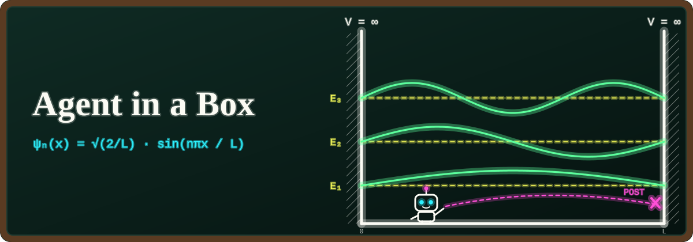

<p align="center">
  
</p>

# Agent in a Box

A course and a small working runtime for learning how to sandbox an agent and how to enforce and reason about its permissions with Cedar policies and formal analysis. See [PLAN.md](PLAN.md) for the design, [CURRICULUM.md](CURRICULUM.md) for the lessons, and [STATUS.md](STATUS.md) for what works today.

**Status: Milestone 0 (platform-independent core).** No native sandbox exists yet. The only way to run the pipeline today is the test backend, `NoEnforcementBackend`, which **contains nothing**: the agent runs as an ordinary process on your machine, and every record says `enforcement: none`. Without `--test-backend`, runs are refused; nothing falls back to running uncontained.

## Setup

Everything installs under your home directory or this repository. Nothing needs `sudo`, and no trust store is touched.

1. Install [uv](https://docs.astral.sh/uv/) (0.12.24 is pinned in decisions/0003) and [rustup](https://rustup.rs/) (Rust 1.89 or later).
2. Create the Python environment (Python 3.12.15 is fetched by uv):

   ```sh
   uv sync --locked
   ```

3. Install the pinned Cedar toolchain into `.toolchain/`: cvc5 1.3.1 (downloaded and checked against `tooling/toolchain.lock.json`) and the Cedar bridge (built from `native/cedar-bridge` with cedar-policy 4.12.0 and SymCC 0.6.0). `--with-cli` also installs the official `cedar` CLI, used only as a test oracle.

   ```sh
   python3 tooling/bootstrap.py --with-cli
   ```

4. Check the setup:

   ```sh
   uv run agent-in-a-box doctor --test-backend
   ```

## First run: the chapter 0 trailer under the test backend

```sh
uv run agent-in-a-box trailer --test-backend
```

The CLI starts a local gateway on 127.0.0.1, then drives the trailer through its API. The scripted agent runs under P0 and then P1, and the solver finds the POST that P1 newly allows. That request is run under both policies, and the repair is checked. The trailer exports a bundle to `.agent-in-a-box/bundles/`. Inspect or re-check a bundle without running anything:

```sh
uv run agent-in-a-box bundle show .agent-in-a-box/bundles/<file>.json
uv run agent-in-a-box bundle replay .agent-in-a-box/bundles/<file>.json
```

`uv run agent-in-a-box chapter5 --test-backend` runs chapter 5's ladder the same way: the POST and PUT counterexamples, the repair, the deny-all repair, and a deliberate "no conclusion".

Run, command, and bundle state lives in `.agent-in-a-box/`. Test-backend bundles are development artifacts. They never go in `bundles/`, which is reserved for native recordings.

## Notebooks (drafts, recorded mode)

```sh
uv sync --locked --extra notebooks
uv run marimo edit notebooks/01_follow_a_request.py
```

The notebooks open the newest bundle in `.agent-in-a-box/bundles/` (or `$AGENT_IN_A_BOX_BUNDLE`). Opening one starts no workload, proxy, or solver. Notebook 04's live button is disabled unless a gateway is running.

## Website (development scaffold)

Node 24.21.0 is pinned in `website/.nvmrc` (decisions/0006).

```sh
uv run agent-in-a-box site-data --trailer <chapter 0 bundle> --chapter5 <chapter 5 bundle>
cd website && npm ci && npm run dev
```

The pages render development bundles produced under the test backend and say so. Nothing is published.

## Tests

```sh
uv run pytest
uv run ruff check src tests tooling
```

Tests marked `toolchain` skip, with the reason shown, if `.toolchain/` is missing. The expected outcomes in `tests/oracle/cedar_cli_cases.json` come from the official Cedar CLI through `python3 tooling/generate_oracle_cases.py`, which never imports this package (decisions/0009); regenerate them only when the policies or the pinned CLI change, and review the diff. The native conformance suite in `tests/backends/conformance/` skips until a native backend's doctor passes on the host.

## Layout

`src/agent_in_a_box/` holds the runtime: `contracts.py` defines the shared records and `composition.py` assembles them. Under it, `policy/` has the schema, evaluators, analyzer, and compiler; `network/` the proxy and fixture service; `supervisor/` the lifecycle and backends; `harness/` and `models/` the agent; `gateway/` and `client/` the API; and `experiments/` the controller, bundles, and CLI. Elsewhere: `policies/` has the schema and the policy variants P0–P6, `fixtures/` the scenario data, `native/cedar-bridge/` the Rust bridge, `tooling/` the pinned toolchain and the oracle generator, `reference/` the platform differences, `assets/` the banner, and `decisions/` the ADRs.
